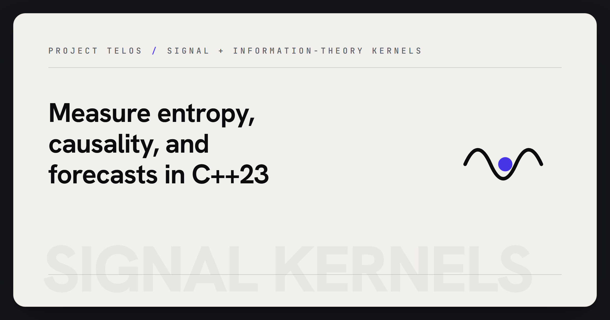

# Signal Kernels



> Analyze information flow with C++23 signal, entropy, causality, and forecasting kernels.

Signal Kernels is a header-only C++23 library for scientific signal processing
and telemetry analytics. It includes entropy measures, divergence metrics,
causal tests, change-point detection, FFT helpers, graph curvature, and
forecasting primitives.

## Why it matters

Large AI and research systems need reliable measurement kernels before a model
interprets noisy data. This repo provides public, testable primitives that can
feed receipt-backed scientific and operational workflows.

## Try it

```bash
cmake -S . -B build -DSIGNAL_KERNELS_BUILD_TESTS=ON
cmake --build build --config Debug
ctest --test-dir build -C Debug --output-on-failure
```

## What to test first

- Build the CMake project with tests enabled.
- Run CTest.
- Include `algorithms/entropy.hpp` or another module in a small C++ target.

## Current status

Header-only C++23 library with unit tests. The bundled CMake setup targets
Windows x64/MSVC, while the headers are standard-library-only.

## Existing technical notes

> Header-only C++23 signal/information-theory library: entropy, MI/transfer entropy, divergences, Granger, PELT, FFT, and forecasting.

[](LICENSE)

[](https://github.com/HarperZ9/signal-kernels/actions/workflows/ci.yml)

[](https://harperz9.github.io)

## Overview

`signal-kernels` implements a focused set of well-known, published analytics
primitives for entropy, forecasting, causal analysis, change-point detection,
graph curvature, and spectral analysis. It depends only on the C++ standard
library and is intended as a reusable foundation for telemetry analytics and
scientific signal processing.

## Modules

- `algorithms/entropy.hpp` -- Shannon, Rényi, Tsallis, min, block, spectral, and
  permutation entropy.
- `algorithms/information.hpp` -- mutual information, transfer entropy, and
  KL / Jensen-Shannon / Hellinger / Wasserstein divergences.
- `algorithms/causal.hpp` -- Granger causality test.
- `algorithms/changepoint.hpp` -- PELT (Pruned Exact Linear Time) change-point
  detection.
- `algorithms/forecast.hpp` -- SARIMA and VAR time-series forecasting.
- `algorithms/curvature.hpp` -- Forman-Ricci and Ollivier-Ricci graph curvature.
- `algorithms/_fft.hpp` -- radix-2 Cooley-Tukey FFT (internal).
- `algorithms/_numeric.hpp` -- Welford variance, log-sum-exp, small-matrix linear
  algebra, autocorrelation, Yule-Walker (internal).

## Why this is publishable

- No offensive-action primitives (no exploitation, command execution,
  persistence, lateral movement, or credential tooling).
- No secrets, credentials, keys, or operator-specific identifiers.
- Standalone build system and public API header set.
- Unit tests are included for all headers.

## Usage

Add `signal-kernels` to your CMake project and link the `signal-kernels`
INTERFACE target:

```cmake
add_subdirectory(signal-kernels)
target_link_libraries(your_target PRIVATE signal-kernels)
```

Then include the headers you need:

```cpp
#include "algorithms/entropy.hpp"

double h = signal_kernels::algorithms::shannon(probs);
```

See [USAGE.md](USAGE.md) for a full walkthrough -- the public function/class
list per header, worked examples with expected output, and build notes. A
single end-to-end program lives at
[`examples/demo_pipeline.cpp`](examples/demo_pipeline.cpp).

## Platform

The bundled `CMakeLists.txt` targets **Windows x64 / MSVC only** and stops with
a fatal error on other platforms. The library is header-only and uses only the
C++23 standard library, so the headers can be compiled with other conforming
toolchains if you bypass the bundled CMake configuration.

## Building and testing

```bash
cmake -S . -B build -DSIGNAL_KERNELS_BUILD_TESTS=ON
cmake --build build --config Debug
ctest --test-dir build -C Debug --output-on-failure
```

Tests are gated on `SIGNAL_KERNELS_BUILD_TESTS` (defaults to `ON` only when
`signal-kernels` is the top-level project). They use
[doctest](https://github.com/doctest/doctest): a vendored copy at
`tests/third_party/doctest/doctest.h` is used if present, otherwise doctest
`v2.4.11` is fetched via `FetchContent`. This test-only dependency does not
affect consumers of the header-only library.

## License

MIT. See [LICENSE](LICENSE).

---
**Zain Dana Harper** -- small tools with explicit edges.
[Portfolio](https://harperz9.github.io) · [HarperZ9](https://github.com/HarperZ9)
<sub>Built with Claude Code; reviewed, tested, and owned by me.</sub>

## For developers

Keep the public README, build notes, and examples aligned with current behavior. Before opening a PR or pushing a release, run the local native verification path.

```bash
cmake -S . -B build
cmake --build build
ctest --test-dir build --output-on-failure
```

See [AGENTS.md](AGENTS.md) for the repo-specific operating boundary and
[CHANGELOG.md](CHANGELOG.md) for current delivery status.
